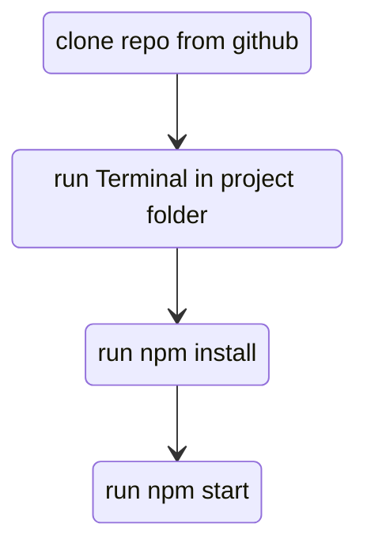

# Right 2 Drive Backend
by Andreas, Taner, Lihem, Kim & Mohammad

---
## TTFHW
### Getting the backend to work
Using Bash, Terminal or PowerShell type:

```
git clone https://github.com/justdReas/right2drive-backend.git
cd [project folder]
npm install
npm start
```
This will ensure that the latest version of dependencies are installed and functional.

---
## Onboarding
### Prerequisites

```
* node
* Heroku
```

### Run



