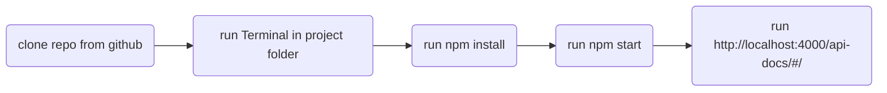

# **Right 2 Drive Backend**

by Andreas, Taner, Lihem, Kim & Mohammad

---
## <u>**TTFHW**</u>
### <u>Getting the backend to work</u>
Using Bash, Terminal or PowerShell type:

```
git clone https://github.com/justdReas/right2drive-backend.git
cd [project folder]
npm install
npm start
```
This will ensure that the latest version of dependencies are installed and functional and that the server is up and running.

### <u>Swagger</u>

Is a platform allowing collaborative designing and documentation of REST APIs.

Make sure the server is running: ``npm start``

[http://localhost:4000/api-docs/#/](http://localhost:4000/api-docs/#/)

```
http://localhost:4000/api-docs/#/
```

---
## <u>**Onboarding**</u>
### <u>Prerequisites</u>

```
* node
* Heroku
```

### Run




---
